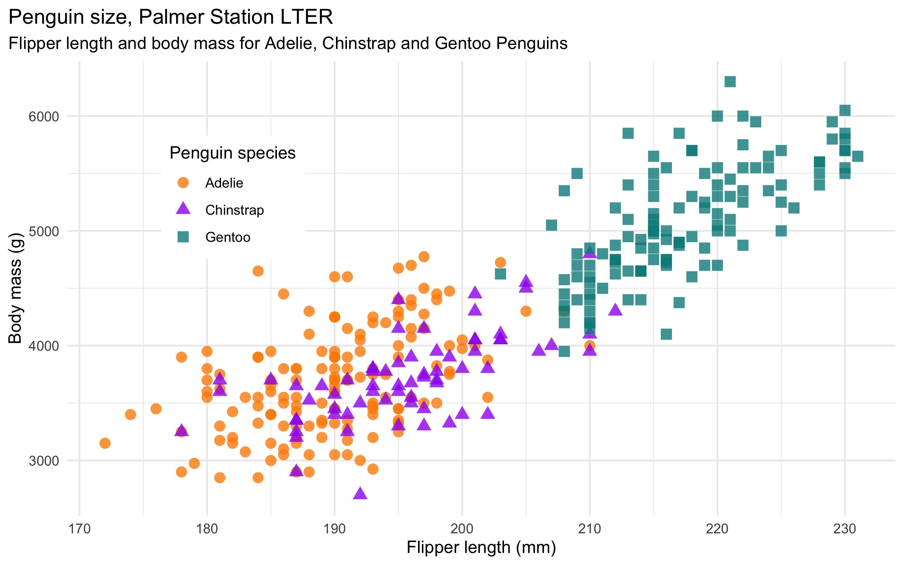

# Penguin Classification Model
## Introduction
This is a machine learning model to classify penguins in Antarctica into three species-Adelie penguins, chinstrap penguins and Gentoo penguins. The classification is done based on characteristics like island(habitat),sex, flipper length, culmen length and depth.

## Dataset
The data was collected from 2007 - 2009, and made available by Dr. Kristen Gorman and the Palmer Station, Antarctica LTER, a member of the Long Term Ecological Research Network. The original data observes 344 penguins for characteristics like island of habitat,sex, flipper length, culmen length and depth, frequency of eggs in females. It was the part of their research- "Ecological Sexual Dimorphism and Environmental Variability within a Community of Antarctic Penguins".
 
The palmerpenguins package contains two datasets. One is called penguins, and is a simplified version of the raw data, called penguins_raw. Both datasets contain data for 344 penguins. There are 3 different species of penguins in this dataset, collected from 3 islands in the Palmer Archipelago, Antarctica. Here, the simplified version of the dataset is used to predict the species of the Antarctic penguins.

## Algorithm
Predictions of species are done using Logistic Regression. Logistic regression is used as the data is linearly seperable as depicted from the graph.

## Working
The independent variables are : island(habitat),sex, flipper length, culmen length and depth
The dependent variable is species of Antarctic Penguin

The model gives an accuracy of 97%

## Conclusion
We conclude that, for Antarctic penguins can be classified into Adelie, Chinstrap and Gentoo penguins with great accuracy by considering their flipper length, culmen length and depth, their sex and island of habitat.

